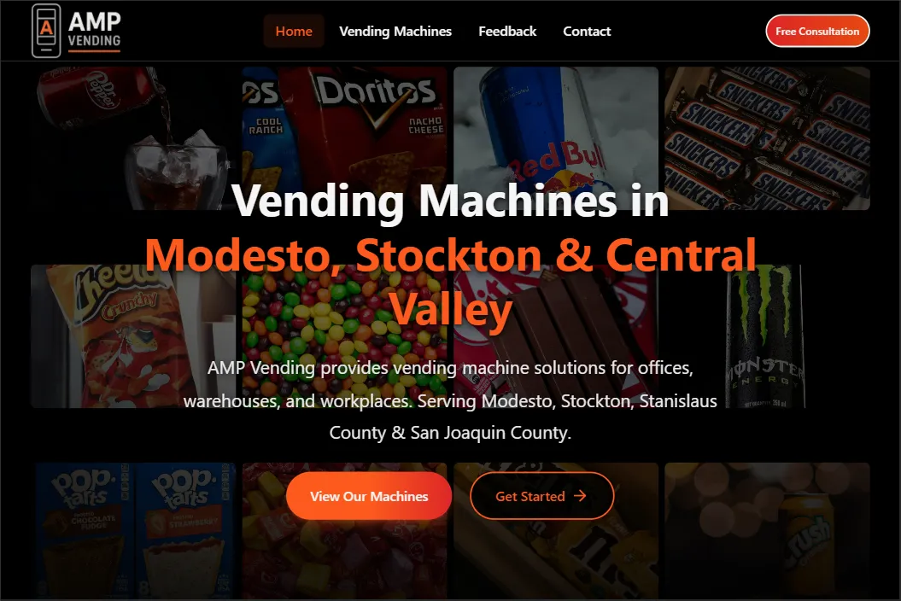

# AMP Vending - Advanced Workplace Vending Solutions

[](https://nextjs.org/)
[](https://react.dev/)
[](https://www.typescriptlang.org/)
[](https://tailwindcss.com/)
[](https://supabase.com/)

**Transform your workplace with state-of-the-art vending machines featuring 21.5" touchscreen technology, contactless payments, and 50+ customizable product options.**

## Live Website

**[https://www.ampvendingmachines.com](https://www.ampvendingmachines.com)**

## 📸 Website Preview

### Hero Section


## Project Overview

AMP Vending is a modern, full-stack web application built for a vending machine company serving Stanislaus County, San Joaquin County, and Central Valley California. The platform showcases advanced vending solutions with comprehensive service packages, featuring an admin dashboard for business management and analytics.

### Business Focus
- **Target Market**: Corporate offices, educational facilities, healthcare centers
- **Service Area**: Central California (Modesto, Stockton, Turlock, Manteca, Tracy)
- **Technology**: 21.5" HD touchscreen interfaces, contactless payments, smart inventory
- **Service Model**: Professional installation with full-service maintenance packages

## Tech Stack

### Frontend
| Technology | Version | Purpose |
|------------|---------|---------|
| Next.js | 16.1 | App Router with RSC |
| React | 19.2 | UI Components |
| TypeScript | 5.7 | Type Safety |
| Tailwind CSS | 3.4 | Styling |
| Framer Motion | 11.15 | Animations |
| Lucide React | 0.468 | Icons |
| React Hook Form | 7.71 | Form Handling |
| Zod | 3.25 | Schema Validation |

### Backend & Services
| Technology | Purpose |
|------------|---------|
| Supabase | PostgreSQL Database & Auth |
| Resend | Transactional Emails |
| Vercel Analytics | Performance Monitoring |
| Microsoft Clarity | User Behavior Analytics |
| Google Maps API | Service Area Visualization |

### Development & Testing
| Tool | Purpose |
|------|---------|
| Jest | Unit Testing |
| Playwright | E2E Testing |
| ESLint | Code Linting |
| Prettier | Code Formatting |
| tsx | TypeScript Script Runner |

## Features

### Public Pages
- **Homepage** - Landing page with hero, features, and service areas
- **Vending Machines** - Machine catalog with detailed specifications
- **Machine Details** - Individual machine pages with image galleries
- **Products** - Product selection showcase
- **Contact** - Contact form with email notifications
- **Feedback** - Customer feedback collection
- **Service Areas** - Location-specific landing pages
- **Custom Request** - Custom vending solution requests
- **Privacy Policy & Terms** - Legal pages
- **Accessibility Statement** - WCAG compliance information

### Admin Dashboard
- **Authentication** - Secure login with JWT & Google OAuth
- **Dashboard Overview** - Business metrics and analytics
- **Machine Management** - CRUD operations for vending machines
- **Product Management** - Product catalog administration
- **Contact Management** - View and manage form submissions
- **Email Management** - Email logs and template management
- **Marketing Tools** - Exit intent popups, email templates
- **SEO Management** - Meta tags and structured data
- **Business Settings** - Company information management
- **Photo Manager** - Image upload and organization
- **Components Showcase** - UI component library preview

### Technical Features
- **Server-Side Rendering** - Next.js App Router with RSC
- **Database Integration** - Supabase PostgreSQL with real-time capabilities
- **Email System** - Automated notifications via Resend API
- **Form Validation** - Zod schemas with React Hook Form
- **Image Optimization** - Next.js Image with WebP support
- **Analytics** - Vercel Analytics + Microsoft Clarity
- **SEO** - Meta tags, JSON-LD schema, sitemap, robots.txt
- **Accessibility** - WCAG 2.1 AA compliance
- **Performance** - Code splitting, lazy loading, optimized assets

## Project Structure

```
amp-vending-website/
├── app/                           # Next.js App Router
│   ├── api/                       # API Routes
│   │   ├── admin/                 # Admin API endpoints
│   │   │   ├── auth/              # Authentication (login, logout, Google OAuth)
│   │   │   ├── machines/          # Machine CRUD operations
│   │   │   ├── products/          # Product management
│   │   │   ├── contacts/          # Contact submissions
│   │   │   ├── emails/            # Email logs and sending
│   │   │   ├── marketing/         # Marketing features
│   │   │   ├── business/          # Business settings
│   │   │   └── seo/               # SEO management
│   │   ├── contact/               # Public contact form handler
│   │   ├── feedback/              # Feedback form handler
│   │   ├── exit-intent/           # Exit intent popup data
│   │   └── health/                # Health check endpoint
│   ├── admin/                     # Admin dashboard pages
│   │   ├── login/                 # Admin authentication
│   │   ├── machines/              # Machine management
│   │   ├── products/              # Product management
│   │   ├── contacts/              # Contact submissions
│   │   ├── emails/                # Email management
│   │   ├── marketing/             # Marketing tools
│   │   ├── seo/                   # SEO settings
│   │   ├── business/              # Business info
│   │   ├── settings/              # Admin settings
│   │   └── photo-manager/         # Image management
│   ├── vending-machines/          # Public machine pages
│   │   └── [id]/                  # Dynamic machine detail pages
│   ├── service-areas/             # Service area landing pages
│   │   └── [area]/                # Dynamic area pages
│   ├── contact/                   # Contact page
│   ├── feedback/                  # Feedback page
│   ├── custom-request/            # Custom request page
│   ├── privacy-policy/            # Privacy policy
│   ├── terms-of-service/          # Terms of service
│   ├── accessibility/             # Accessibility statement
│   ├── layout.tsx                 # Root layout
│   ├── page.tsx                   # Homepage
│   └── not-found.tsx              # 404 page
├── components/                    # React Components
│   ├── admin/                     # Admin dashboard components
│   ├── analytics/                 # Analytics tracking components
│   ├── contact/                   # Contact form components
│   ├── feedback/                  # Feedback components
│   ├── forms/                     # Reusable form components
│   ├── hero/                      # Hero section components
│   ├── landing/                   # Landing page sections
│   ├── layout/                    # Layout components (Header, Footer)
│   ├── marketing/                 # Marketing components
│   ├── products/                  # Product display components
│   ├── seo/                       # SEO components
│   ├── ui/                        # Reusable UI components
│   ├── vending-machines/          # Machine-specific components
│   └── a11y/                      # Accessibility components
├── hooks/                         # Custom React hooks
├── lib/                           # Utility libraries
│   ├── data/                      # Data management
│   ├── services/                  # External service integrations
│   ├── schema/                    # Zod validation schemas
│   └── utils/                     # Helper functions
├── public/                        # Static assets
│   ├── images/                    # Image assets
│   │   ├── machines/              # Vending machine photos
│   │   ├── products/              # Product images
│   │   ├── logo/                  # Brand logos
│   │   └── preview/               # Website previews
│   └── icons/                     # Icon assets
├── scripts/                       # Build and utility scripts
├── styles/                        # Global styles
└── tests/                         # Test files
    ├── unit/                      # Unit tests
    └── e2e/                       # End-to-end tests
```

## Getting Started

### Prerequisites
- Node.js 18.0 or higher
- npm package manager
- Supabase account (for database)
- Resend account (for emails)

### Installation

1. **Clone the repository**
   ```bash
   git clone <repository-url>
   cd amp-vending-website
   ```

2. **Install dependencies**
   ```bash
   npm install
   ```

3. **Environment Setup**

   Create a `.env.local` file with required variables:
   ```env
   # Database
   NEXT_PUBLIC_SUPABASE_URL=your_supabase_url
   NEXT_PUBLIC_SUPABASE_ANON_KEY=your_supabase_anon_key
   SUPABASE_SERVICE_ROLE_KEY=your_service_role_key

   # Email
   RESEND_API_KEY=your_resend_api_key

   # Authentication
   JWT_SECRET=your_jwt_secret

   # Google Maps (optional)
   NEXT_PUBLIC_GOOGLE_MAPS_API_KEY=your_google_maps_key

   # Analytics (optional)
   NEXT_PUBLIC_CLARITY_PROJECT_ID=your_clarity_id
   ```

4. **Run development server**
   ```bash
   npm run dev
   ```

5. **Open browser**
   Navigate to [http://localhost:3000](http://localhost:3000)

### Available Scripts

| Command | Description |
|---------|-------------|
| `npm run dev` | Start development server |
| `npm run build` | Build for production |
| `npm run start` | Start production server |
| `npm run lint` | Run ESLint |
| `npm run lint:fix` | Fix ESLint issues |
| `npm run type-check` | Run TypeScript type checking |
| `npm run test` | Run Jest tests |
| `npm run test:coverage` | Run tests with coverage |
| `npm run test:e2e` | Run Playwright E2E tests |
| `npm run test:all` | Run all tests |
| `npm run format` | Format code with Prettier |
| `npm run lighthouse` | Run Lighthouse performance tests |

## Design System

### Color Palette
```scss
--color-black: #000000        // Primary backgrounds
--color-dark-gray: #4d4d4d    // Secondary backgrounds
--color-silver: #A5ACAF       // Text and borders
--color-whitesmoke: #F5F5F5   // Primary text
--color-orange: #FD5A1E       // Accent and CTAs
```

### Typography
- **Headings**: Inter (700 weight)
- **Body**: Inter (400-500 weight)
- **System**: Falls back to system fonts

### Responsive Breakpoints
```scss
sm: 640px    // Small tablets
md: 768px    // Tablets
lg: 1024px   // Laptops
xl: 1280px   // Desktops
2xl: 1536px  // Large screens
```

## SEO Features

- Meta tags with dynamic generation
- JSON-LD structured data (LocalBusiness, Product, FAQ)
- XML sitemap (auto-generated)
- Robots.txt configuration
- Open Graph tags for social sharing
- Twitter Cards support
- Canonical URL management
- Service area landing pages for local SEO

## Deployment

The application is deployed on Vercel with automatic deployments from the main branch.

### Environment Variables
Configure all required environment variables in the Vercel dashboard before deployment.

## License

This project is proprietary software owned by AMP Vending. All rights reserved.

## Contact

**AMP Vending**
- **Website**: [https://www.ampvendingmachines.com](https://www.ampvendingmachines.com)
- **Email**: [ampdesignandconsulting@gmail.com](mailto:ampdesignandconsulting@gmail.com)
- **Phone**: [(209) 403-5450](tel:+12094035450)
- **Location**: Modesto, CA 95354

---

*Built with Next.js, React, TypeScript, and Tailwind CSS*
