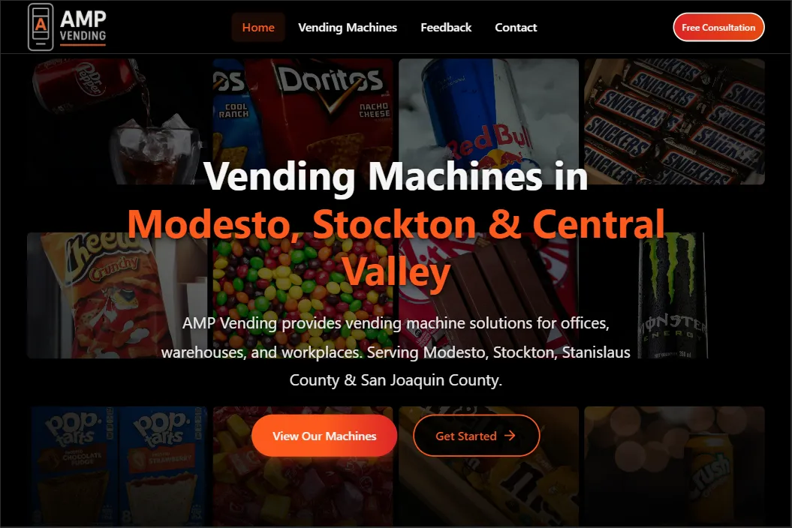

# AMP Vending Machines — Full-Stack Business Website

[](https://nextjs.org/)
[](https://react.dev/)
[](https://www.typescriptlang.org/)
[](https://tailwindcss.com/)
[](https://supabase.com/)

> **Transform your workplace with state-of-the-art vending machines featuring 21.5" touchscreen technology, contactless payments, and 50+ customizable product options.**

---

## 🌐 Live Website

**[ampvendingmachines.com](https://www.ampvendingmachines.com)** — Production deployment on Vercel

---

## 📸 Preview

### Hero Section


---

## 🎯 Project Overview

AMP Vending is a **production full-stack web application** built for a vending machine company serving Stanislaus County, San Joaquin County, and the broader Central Valley, California. This is a real client with real traffic — not a demo.

### What This Project Demonstrates

This project was built to solve real business problems:

- **Lead generation** — Contact and custom request forms feed directly into a Supabase database and trigger email notifications via Resend, so no inquiry is lost
- **Local SEO** — Service-area landing pages for 5+ Central Valley cities (Modesto, Stockton, Turlock, Manteca, Tracy), each with city-specific JSON-LD LocalBusiness schema, meta tags, and content
- **Content management** — Full admin dashboard with login, so the business owner can update machine inventory, products, photos, and business info without touching code
- **Trust & conversion** — WCAG 2.1 AA compliance, fast page loads, clear CTAs, and professional design

### Business Context

| | |
|--|--|
| **Target Market** | Corporate offices, educational facilities, healthcare centers |
| **Service Area** | Central California — Modesto, Stockton, Turlock, Manteca, Tracy |
| **Technology** | 21.5" HD touchscreen interfaces, contactless payments, smart inventory |
| **Service Model** | Professional installation with full-service maintenance packages |

---

## 🏗️ Business Impact

| Capability | Implementation | Business Benefit |
|---|---|---|
| Service area pages | Dynamic routes `/service-areas/[area]` | Ranks for "vending machines in [city]" searches |
| Admin dashboard | Supabase CRUD + JWT auth | Owner manages content without developer |
| Contact + email | Resend API + auto-reply | No lead slips through |
| JSON-LD schema | LocalBusiness + Product + FAQ | Google rich results eligibility |
| Machine catalog | Dynamic pages with image galleries | Online storefront replacing brochures |
| Photo manager | Admin upload + WebP optimization | Always fresh visual content |

---

## 🛠️ Tech Stack

### Frontend

| Technology | Version | Purpose |
|---|---|---|
| Next.js | 16.1 | App Router with React Server Components |
| React | 19.2 | UI Components |
| TypeScript | 5.7 | Type Safety |
| Tailwind CSS | 3.4 | Styling |
| Framer Motion | 11.15 | Page transitions and micro-animations |
| Lucide React | 0.468 | Icon library |
| React Hook Form | 7.71 | Form handling |
| Zod | 3.25 | Schema validation |

### Backend & Services

| Technology | Purpose |
|---|---|
| Supabase | PostgreSQL database, real-time, storage, auth |
| Resend | Transactional emails with auto-reply templates |
| Vercel Analytics | Core Web Vitals monitoring |
| Microsoft Clarity | Heatmaps and session recording |
| Google Maps API | Interactive service area map |

### Testing & DevOps

| Tool | Purpose |
|---|---|
| Jest | Unit and integration tests |
| Playwright | End-to-end test suite (e2e/) |
| ESLint + Prettier | Code quality |
| GitHub Actions | CI/CD pipeline |
| Vercel | Zero-downtime deployments |

---

## ✨ Features

### Public-Facing Pages

- **Homepage** — Hero, feature highlights, service area overview, social proof
- **Vending Machines** — Machine catalog with detailed specifications
- **Machine Details** — Dynamic `[id]` pages with image galleries and specs
- **Products** — Product selection showcase
- **Contact** — Form with email notifications and auto-reply
- **Custom Request** — Configure a custom vending solution
- **Service Areas** — Location-specific landing pages (Modesto, Stockton, Turlock, Manteca, Tracy)
- **Feedback** — Customer satisfaction collection
- **Accessibility Statement** — WCAG 2.1 AA compliance documentation
- **Legal** — Privacy Policy and Terms of Service

### Admin Dashboard (`/admin`)

- **Login** — JWT auth + Google OAuth
- **Dashboard** — KPI overview, recent contacts, activity feed
- **Machine Management** — Full CRUD: add, edit, delete, reorder machines
- **Product Management** — Product catalog administration
- **Contact Management** — View, filter, and respond to submissions
- **Email Management** — Logs, templates, manual sends
- **Photo Manager** — Upload, organize, WebP-optimize images
- **Marketing** — Exit intent popups, email capture
- **SEO Management** — Meta tags and structured data per page
- **Business Settings** — Company info, hours, contact details

### Technical Features

- **Server-Side Rendering** — Next.js App Router with RSC for fast initial loads
- **Database** — Supabase PostgreSQL with Row Level Security and real-time subscriptions
- **Email** — Resend-powered notifications with branded templates and auto-reply
- **Validation** — End-to-end Zod schemas shared between frontend and API routes
- **Image Optimization** — Next.js Image component with WebP conversion and lazy loading
- **SEO** — JSON-LD (LocalBusiness, Product, FAQ), canonical URLs, Open Graph, Twitter Cards
- **Accessibility** — WCAG 2.1 AA: ARIA labels, keyboard nav, skip links, focus management
- **Performance** — Code splitting, lazy loading, Vercel Edge CDN, optimized Core Web Vitals

---

## 📁 Project Structure

```
amp-vending-website/
├── app/                           # Next.js App Router
│   ├── api/                       # API routes (admin + public)
│   │   ├── admin/                 # Protected admin endpoints
│   │   │   ├── auth/              # Login, logout, OAuth
│   │   │   ├── machines/          # Machine CRUD
│   │   │   ├── products/          # Product management
│   │   │   ├── contacts/          # Submission management
│   │   │   ├── emails/            # Email logs and sending
│   │   │   ├── marketing/         # Popup and capture tools
│   │   │   ├── business/          # Business settings
│   │   │   └── seo/               # SEO per-page settings
│   │   ├── contact/               # Public contact form handler
│   │   ├── feedback/              # Feedback handler
│   │   └── health/                # Health check
│   ├── admin/                     # Protected dashboard pages
│   ├── vending-machines/          # Machine catalog + detail pages
│   ├── service-areas/[area]/      # Location-specific landing pages
│   ├── contact/                   # Contact page
│   ├── custom-request/            # Custom vending request
│   ├── layout.tsx                 # Root layout with providers
│   └── page.tsx                   # Homepage
│
├── components/                    # React components
│   ├── admin/                     # Dashboard UI components
│   ├── contact/                   # Contact form components
│   ├── hero/                      # Hero section variants
│   ├── landing/                   # Homepage section components
│   ├── layout/                    # Header, footer, nav
│   ├── seo/                       # JSON-LD, meta components
│   ├── ui/                        # Reusable design system components
│   ├── vending-machines/          # Machine-specific components
│   └── a11y/                      # Accessibility helpers
│
├── hooks/                         # Custom React hooks
├── lib/                           # Utilities and services
│   ├── data/                      # Data access layer
│   ├── services/                  # External service integrations
│   ├── schema/                    # Zod validation schemas
│   └── utils/                     # Helper functions
│
├── supabase/                      # DB migrations and types
├── e2e/                           # Playwright end-to-end tests
├── tests/                         # Jest unit and integration tests
└── types/                         # Global TypeScript type definitions
```

---

## 🚀 Getting Started

### Prerequisites

- Node.js 18.0+
- npm
- Supabase account
- Resend account

### Installation

```bash
# 1. Clone
git clone https://github.com/AaronAPerez/AMP-Vending-Machines-Website.git
cd AMP-Vending-Machines-Website

# 2. Install dependencies
npm install

# 3. Configure environment
cp .env.example .env.local
# Edit .env.local with your credentials (see below)

# 4. Run development server
npm run dev
```

### Environment Variables

```env
# Supabase
NEXT_PUBLIC_SUPABASE_URL=your_supabase_url
NEXT_PUBLIC_SUPABASE_ANON_KEY=your_supabase_anon_key
SUPABASE_SERVICE_ROLE_KEY=your_service_role_key

# Email (Resend)
RESEND_API_KEY=your_resend_api_key

# Authentication
JWT_SECRET=your_jwt_secret

# Google Maps (optional)
NEXT_PUBLIC_GOOGLE_MAPS_API_KEY=your_maps_key

# Analytics (optional)
NEXT_PUBLIC_CLARITY_PROJECT_ID=your_clarity_id
```

### Available Scripts

| Command | Description |
|---|---|
| `npm run dev` | Start development server |
| `npm run build` | Production build |
| `npm run start` | Start production server |
| `npm run lint` | ESLint check |
| `npm run lint:fix` | Auto-fix lint issues |
| `npm run type-check` | TypeScript strict check |
| `npm run test` | Jest unit tests |
| `npm run test:coverage` | Tests + coverage report |
| `npm run test:e2e` | Playwright E2E tests |
| `npm run test:all` | All tests |
| `npm run format` | Prettier format |
| `npm run lighthouse` | Lighthouse performance audit |

---

## 🎨 Design System

### Color Palette

```css
--color-black:       #000000   /* Primary backgrounds */
--color-dark-gray:   #4d4d4d   /* Secondary backgrounds */
--color-silver:      #A5ACAF   /* Borders and muted text */
--color-whitesmoke:  #F5F5F5   /* Primary text */
--color-orange:      #FD5A1E   /* Brand accent, CTAs */
```

### Typography

- **Headings**: Inter 700
- **Body**: Inter 400–500
- Falls back to system fonts for performance

### Breakpoints

```css
sm:  640px   /* Small tablets */
md:  768px   /* Tablets */
lg:  1024px  /* Laptops */
xl:  1280px  /* Desktops */
2xl: 1536px  /* Large screens */
```

---

## 🔍 SEO Implementation

- **Dynamic meta tags** — Per-page title, description, canonical URL via Next.js Metadata API
- **JSON-LD structured data** — `LocalBusiness`, `Product`, `FAQPage` schemas
- **Sitemap** — Auto-generated XML at `/sitemap.xml`
- **Robots.txt** — Configured for crawlability
- **Open Graph** — Social sharing cards for all pages
- **Twitter Cards** — Optimized preview cards
- **Location pages** — City-specific content for Modesto, Stockton, Turlock, Manteca, Tracy
- **Search Console** — Google and Bing verification files included

---

## ♿ Accessibility

- WCAG 2.1 AA compliant
- Full keyboard navigation
- Skip-to-content links
- ARIA labels on all interactive elements
- Focus trap management in modals
- Accessible color contrast ratios
- Screen reader tested
- Accessibility statement page at `/accessibility`

---

## 📦 Deployment

Production deployment on **Vercel** with:
- Automatic deploys from `main` branch
- Preview deployments for PRs
- Environment variables managed in Vercel dashboard
- Analytics and speed insights enabled

---

## 📞 Contact

**AMP Vending**
- **Website**: [ampvendingmachines.com](https://www.ampvendingmachines.com)
- **Email**: ampdesignandconsulting@gmail.com
- **Phone**: (209) 403-5450
- **Service Area**: Modesto, CA and Central Valley

---

*Built with Next.js, React 19, TypeScript, Tailwind CSS, and Supabase by [Aaron Perez / AP Designs](https://aaronaperez.dev)*

